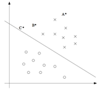

---

---

CS229 Lecture notes

原作者：[Andrew Ng](http://cs229.stanford.edu/)（[吴恩达](http://open.163.com/movie/2008/1/M/C/M6SGF6VB4_M6SGHFBMC.html)）

翻译：[CycleUser](https://zhuanlan.zhihu.com/python-kivy)

# Part V: 支持向量机（Support Vector Machines）
本章的讲义主要讲述的是 支持向量机( Support Vector Machine ，缩写为 SVM) 学习算法。SVM 算得上是现有的最好的现成的（“off-the-shelf”）监督学习算法之一，很多人实际上认为这里没有“之一”这两个字的必要，认为 SVM 就是最好的现成的监督学习算法。讲这个 SVM 的来龙去脉之前，我们需要先讲一些关于边界的内容，以及对数据进行分割成大的区块（gap）的思路。接下来，我们要讲一下最优边界分类器（optimal margin classifier,），其中还会引入一些关于拉格朗日对偶（Lagrange duality）的内容。然后我们还会接触到核（Kernels），这提供了一种在非常高的维度（例如无穷维度）中进行 SVM 学习的高效率方法，最终本章结尾部分会讲 SMO 算法，也就是 SVM 算法的一个有效实例。

# 1. 边界（Margins）:直觉（Intuition）
咱们这回讲 SVM 学习算法，从边界（margins）开始说起。这一节我们会给出关于边界的一些直观展示（intuitions），以及过对于我们做出的预测的信心（confidence）；在本章的第三节中，会对这些概念进行更正式化的表述。

考虑逻辑回归，其中的概率分布p(y = 1|x; θ) 是基于 hθ(x) = g(θTx) 而建立的模型。当且仅当 hθ(x) ≥ 0.5 ，也就是 θTx ≥ 0 的时候，我们才会预测出“1”。假如有一个正向（Positive）的训练样本（positive training example）（y = 1）。那么θTx 越大，hθ (x) = p(y = 1|x; w, b) 也就越大，我们对预测 Label 为 1 的“信心（confidence）”也就越强。所以如果 y = 1 且 θT x ≫ 0（远大于 0），那么我们就对这时候进行的预测非常有信心，当然这只是一种很不正式的粗略认识。与之类似，在逻辑回归中，如果有 y = 0 且 θT x ≪ 0（远小于 0），我们也对这时候给出的预测很有信心。所以还是以一种非常不正式的方式来说，对于一个给定的训练集，如果我们能找到一个 θ，满足当 y(i) = 1 的时候总有 θT x(i) ≫ 0，而 y(i) = 0 的时候则 θT x(i) ≪ 0，我们就说这个对训练数据的拟合很好，因为这就能对所有训练样本给出可靠（甚至正确）的分类。似乎这样就是咱们要实现的目标了，稍后我们就要使用函数边界记号（notion of functional margins）来用正规的语言来表达该思路。

还有另外一种的直观表示，例如下面这个图当中，画叉的点表示的是正向训练样本，而小圆圈的点表示的是负向训练样本，图中还画出了分类边界（decision boundary），这条线也就是通过等式 θT x = 0 来确定的，也叫做分类超平面（separating hyperplane）。图中还标出了三个点 A，B 和 C。

可以发现 A 点距离分界线很远。如果我们对 A 点的 y 值进行预测，估计我们会很有信心地认为在那个位置的 y = 1。与之相反的是 C，这个点距离边界线很近，而且虽然这个 C 点也在预测值 y = 1 的一侧，但看上去距离边界线的距离实在是很近的，所以也很可能会让我们对这个点的预测为 y = 0。因此，我们对 A 点的预测要比对 C 点的预测更有把握得多。B 点正好在上面两种极端情况之间，更广泛地说，如果一个点距离分类超平面（separating hyperplane）比较远，我们就可以对给出的预测很有信心。那么给定一个训练集，如果我们能够找到一个分类边界，利用这个边界我们可以对所有的训练样本给出正确并且有信心（也就是数据点距离分类边界要都很远）的预测，那这就是我们想要达到的状态了。当然上面这种说法还是很不正规，后面我们会使用几何边界记号（notion of geometric margins）来更正规地来表达。

## 2. 记号（Notation）

在讨论 SVMs 的时候，出于简化的目的，我们先要引入一个新的记号，用来表示分类。假设我们要针对一个二值化分类的问题建立一个线性分类器，其中用来分类的标签（label）为 y，分类特征（feature）为 x。从此以后我们就用 y ∈ {−1, 1} (而不是之前的 {0, 1}) 来表示这个分类标签了。另外，以后咱们也不再使用向量 θ 来表示咱们这个线性分类器的参数了，而是使用参数 w 和 b，把分类器写成下面这样：

当 z ≥ 0，则 g(z) = 1；而反之若 z ＜ 0，则g(z) = -1。这里的这个 “w, b” 记号就可以让我们能把截距项（intercept term）b 与其他的参数区别开。（此外我们也不用再像早些时候那样要去设定 x0 = 1 这样的一个额外的输入特征向量了。）所以，这里的这个参数 b 扮演的角色就相当于之前的参数 θ0 ，而参数 w 则相当于 [θ1 . . . θn]T。

还要注意的是，从我们上面对函数 g 的定义，可以发现我们的分类器给出的预测是 1 或者 -1 （参考 感知器算法 perceptron algorithm），这样也就不需要先通过中间步骤（intermediate step）来估计 y 为 1 的概率（这就是逻辑回归中的步骤）。