CS229 Lecture notes

原作者：[*Andrew Ng*](http://cs229.stanford.edu/)（[*吴恩达*](http://open.163.com/movie/2008/1/M/C/M6SGF6VB4_M6SGHFBMC.html)）

翻译：[*CycleUser*](https://zhuanlan.zhihu.com/python-kivy)

# Part V
:学习理论（Learning Theory） 

# 1 偏差/方差的权衡（Bias/variance tradeoff ）

在讲线性回归的时候，我们讨论过这样的问题：拟合数据的时候，选择线性的“y = θ0 +θ1x”这样的“简单”模型，还是选择多项式的“y=θ0+θ1x+···θ5x5”这种“复杂”模型。如下图所示：

如最右侧图所示，用一个五次多项式来进行拟合，得到的并不是一个好模型。而且，这个五次多项式对于训练集中的每一个 x（例如之前文中说的居住面积）都给出了非常好的预测的 y 值（对应的就是房屋价格），我们也不能指望这个模型能够对训练集之外的点给出靠谱的预测。换句话说，用这种高次多项式来对训练集进行学习得到的模型根本不能扩展运用到其他房屋上面去。一个推测模型（hypothesis）的泛化误差（generalization error，稍后再给出正式定义）正式那些不属于训练集的样本潜在的预期偏差（expected error on examples not necessarily in the training set）。

上面图中最左边的线性拟合和最右边的高次多项式拟合都有非常大的泛化误差。然而，这两个模型各自出的问题是很不一样的。如果 y 和 x 之间的关系不是线性的，那么即便我们有一个非常大规模的训练集，然后用来进行线性拟合，得到的线性模型都还是不能够准确捕捉到数据的结构。我们粗略地将一个模型的偏差（bias）定义为预期的泛化误差（expected generalization error），即便我们要去拟合的对象是一个非常大的甚至是无限的训练数据集。这样的话，对于上面三幅图中所展示的那个情况来看，最左边的那个线性模型就具有特别大的偏差（bias），可能是对数据欠拟合（也就是说，没有捕捉到数据所体现的结构特征）。

除了这个偏差（bias）之外，还有另外一个构成泛化误差（generalization error）的因素，也就是模型拟合过程的方差（variance）。例如在最右边的图中，使用了五次多项式进行了拟合，这样有很大的风险，很可能我们基于数据拟合出来的模型可能碰巧只适合于眼下这个小规模的有限的训练集，而并不能反映 x 和 y 之间更广泛的关系。例如，在实际中，可能我们选择的训练集中的房屋碰巧就是一些比平均价格要稍微贵一些的房屋，也可能有另外的一些比平均值要低一点的房屋，等等。通过对训练集拟合得到的这个“不太靠谱的（spurious）”的模式，我们得到的可能也就是一个有很大泛化误差（large generalization error）的模型。这样的话，我们就说这个模型的方差很大（large variance）。

1在讲义里面，我们不准备给出对偏差（bias）和方差（variance）给出正式的定义，也就说道上面讨论这样的程度而已。当然了，这两者都有严格的正式定义，例如在线性回归里面，对于这两者的定义，有若干不同的观点，但是哪一个最权威最正确（right）呢？这个还有争议的。

通常情况下，咱们需要再偏差（bias）和方差（variance）之间进行权衡妥协。如果我们的模型过于“简单（simple）”，而且参数非常少，那这样就可能会有很大的偏差（bias），而方差（variance）可能就很小；如果我们的模型过于“复杂（complex）”，有非常多的参数，那就可能反过来又特别大的方差（variance），而偏差（bias）就会小一些。在上面三种不同拟合的样例中，用二次函数来进行拟合得到的效果，明显是胜过一次线性拟合，也强于五次多项式拟合。

# 2 预先准备（Preliminaries）

在这一部分的讲义中，我们要开始进入到机器学习的理论（learning theory）了。本章内容非常有趣，而且有启发性，还能帮助我们培养直觉，能够得到在不同背景下如何最佳应用学习算法的经验规则。此外，我们还会探究一些问题：首先，上文我们刚刚谈论到的偏差（bias）/方差（variance），能不能更正规地总结一下？这个问题还会引出关于模型选择的方法，这些方法可以在对一个训练集进行拟合的时候来帮助确定要用的多项式应该是几阶的。其次，在机器学习的过程中，我们真正关注的也就是泛化误差（generalization error），不过绝大部分的学习算法都是将训练集和模型结合的。那么针对训练集的表现好坏程度，为何就能告诉我们泛化误差的信息呢？例如，我们能将训练集的误差和泛化误差联系起来么？第三个，也是最后一点，是否存在某些条件，我们能否在这些条件下证明某些学习算法能够良好工作？

我们先来给出两个很简单又很有用的引理（lemma）。

引理1 (联合约束，The union bound)。设 A1, A2, ..., Ak 是 K个不同事件（但不一定互相独立），则有：

在概率论中，联合约束通常被当做是公理（所以我们就不尝试证明了），实际上也很直观的： k 个事件同时发生的概率最多是 k 个不同的事件每个都发生的概率的总和。

引理2 (Hoeffding 不等式) 。设 Z1, ... , Zm 是 m 个独立的并且共同遵循伯努利分布（Bernoulli(φ) distribution）的随机变量（independent and identically distributed (iid) random variables）。例如：P(Zi =1)=φ 而 P(Zi =0)=1−φ. 设 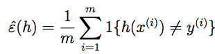是这些随机变量的平均值，然后设任意的 γ &gt; 0 为某一固定值（fixed），则有：

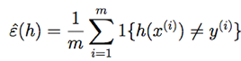

上面这个引理（在机器学习理论里面也称为 切尔诺夫约束，Chernoff bound）表明，如果我们我们从一个伯努利分布的随机变量中选取平均值 φˆ—来作为对 φ 的估计值，那么只要 m 足够大，我们偏移真实值很远的概率就比较小。另外一种表述方式是：如果你有一个有偏差的硬币（biased coin），抛起来落下人头朝上的概率是 φ，如果你抛了 m 此，然后计算人头朝上的比例，若 m 非常大，那么这个比例的值，就是一个对 φ 的一个概率很高的很好的估计。

基于上面这两个引理，我们就可以去证明在机器学习理论中一些很深刻和重要的结论了。

为了简化表述，我们先集中关注一下二分法分类，其中的标签简化为 y ∈ {0, 1}。然后我们即将讲到的所有内容也都会推广到其它问题中，例如回归问题以及多类别的分类问题等等。

假设我们有一个给定的训练集 S = {(x(i),y(i));i = 1,...,m}，其样本规模为 m，集合中的训练样本 (x(i),y(i)) 是可以符合某概率分布 D 来的独立且同分布的随机变量。设一个假设（hypothesis）为 h，我们则用如下的方法定义训练误差（也成为学习理论中的经验风险 empirical risk 或者经验误差 empirical error）：

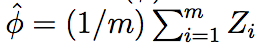

这个值只是假设模型 h 分类错误样本占据训练样本总数的分数。如果我们要特定指针对某个训练样本集合 S 的经验误差 εˆ(h)，可以写作 εˆS(h)。然后我们就可以定义泛化误差（generalization error）为：

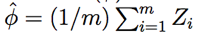

经验误差 εˆ(h) 的这个定义实际上也就相当于，基于分布 D 给出的一个新的样本 (x, y) ，假设模型 h 对该样本分类错误的概率。

要注意，这里我们有一个预先假设，也就是训练集的数据与要用来检验假设用的数据都服从同一个分布 D（这一假设存在于对泛化误差的定义中）。这个假设通常也被认为是 PAC 假设之一。2

2PAC 是一个缩写，原型为“probably approximately correct”，这是一个框架和一系列假设的集合，在机器学习理论中的很多结构都是基于这些假设而证明得到的。这个系列假设中最重要的两个，就是训练集与测试集服从同一分布，以及训练样本的独立性。

考虑线性分类的情况，假设 hθ (x) = 1{θT x ≥ 0}。拟合参数 θ 的合理方法是什么呢？一个思路就是可以使训练误差（training error）最小化，然后选择取最小值的时候的 θ：

我们把上面这个过程称之为经验风险最小化（empirical risk minimization，缩写为 ERM），而这种情况下通过学习算法得到的假设结果就是 hˆ = hθˆ 。我们把 ERM 看做为最“基础（basic）”的学习算法，在这一系列的讲义中我们主要关注的就是这种算法。（其他的例如逻辑回归等等算法也可以看作是对 ERM 的某种近似（approximations）。）

In our study of learning theory, it will be useful to abstract away from the specific parameterization of hypotheses and from issues such as whether we’re using a linear classifier. We define the hypothesis class H used by a learning algorithm to be the set of all classifiers considered by it. For linear classification, H = {hθ : hθ(x) = 1{θTx ≥ 0}, θ ∈ Rn+1} is thus the set of all classifiers over X (the domain of the inputs) where the decision boundary is linear. More broadly, if we were studying, say, neural networks, then we could let H be the set of all classifiers representable by some neural network architecture.

在咱们关于机器学习理论的研究中，有一种做法很有用处，就是把具体的参数化（specific parameterization）抽象出去，并且也把是否使用线性分选器（linear classifier）之类的问题也抽象出去。我们把学学习算法所使用的假设类（hypothesis class）H 定义为所有分类器的集合（set of all classifiers）。对于线性分类问题来说，H = {hθ : hθ(x) = 1{θTx ≥ 0}, θ ∈ Rn+1}，是一个对 X（输入特征） 进行分类的所有分类器的集合，其中所有分类边界为线性。更广泛来说，假设我们研究神经网络（neural networks），那么可以设 H 为能表示某些神经网络结构的所有分类器的集合。

现在就可以把 经验风险最小化（ERM）看作是对函数类 H 的最小化，其中由学习算法来选择假设（hypothesis）：

# 3 有限个假设（finite H）的情况 

我们首先来考虑一下假设类有限情况下的学习问题，其中假设类 H = {h1, ..., hk}，由 k 个不同假设组成。因此，H 实际上就是由 K 个从输入特征 X 映射到集合 {0, 1} 的函数组成的集合，而经验风险最小化（ERM）就是从这样的 K 个函数中选择训练误差最小（smallest training error）的作为 hˆ。

We would like to give guarantees on the generalization error of hˆ. Our strategy for doing so will be in two parts: First, we will show that εˆ(h) is a reliable estimate of ε(h) for all h. Second, we will show that this implies an upper-bound on the generalization error of hˆ.

我们希望能够确保 hˆ 的泛化误差。这需要两个步骤：首先要表明 εˆ(h) 是对所有 h 的 ε(h) 的一个可靠估计。其次就需要表明这个 εˆ(h) 位于 hˆ 泛化误差的上界。

任选一个固定的 hi ∈ H。假如有一个伯努利随机变量（Bernoulli random variable） Z，其分布入下面式中定义。 然后我们从 D 中取样 (x, y)，并设 Z = 1{hi(x) ̸= y}。也就是说，我们会选择一个样本，然后令 Z 指示 hi 是否对该样本进行了错误分类。类似地，我们还定义了一个 Zj = 1{hi(x(j)) ̸= y(j)}。由于我们的训练样本都是从 D 中取来的独立随机变量（iid），所以在此基础上构建的 Z 和 Zj 也都服从相同的分布。

这样就能找到针对随机选取的训练样本进行错误分类的概率 — 也就是 ε(h) — 正好就是 Z (以及 Zj) 的期望值（expected value）。然后，就可以把训练误差写成下面这种形式：

因此，εˆ(hi) 就正好是 m 个随机变量 Zj 的平均值，而这个 Zj 是服从伯努利分布的独立随机变量（iid），其均值就是 ε(hi)。接下来，就可以使用 Hoeffding 不等式，得到下面的式子：

这就表明，对于我们给定的某个固定的 hi，假如训练样本的规模 m 规模很大的时候，训练误差有很接近泛化误差（generalization error）的概率是很高的。然而我们不仅仅满足于针对某一个特定的 hi 的时候能保证 ε(hi) 接近 εˆ(hi) 且接近的概率很高。我们还要证明同时针对所有的 h ∈ H 这个结论都成立。 为了证明这个结论，我们设 Ai 来表示事件 |ε(hi) − εˆ(hi)| &gt; γ。我们已经证明了，对于任意的固定的 Ai，都有 P(Ai) ≤ 2exp(−2γ2m) 成立。接下来，使用联合约束（union bound），就可以得出下面的关系：

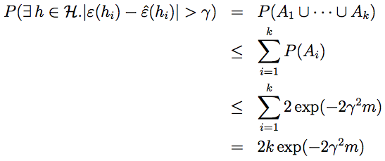

如果等式两边都用 1 来减去原始值（subtract both sides from 1），则不等关系改变为：

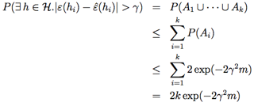

（“¬” 这个符号的意思是 “非”。）如上所示，至少有 1−2k exp(−2γ2m) 的概率，我们能确保对于所有的 h ∈ H，ε(h) 在 εˆ(h) 附近的 γ 范围内。这种结果就叫做一致收敛结果（uniform convergence result），因为这是一个针对所有的 h ∈ H 都同时成立的约束（与之相反的是只针对某一个 h 才成立的情况）。

在上面的讨论中，我们涉及到的是针对某些 m 和 γ 的特定值，给定一个概率约束：对于某些 h ∈ H, 都有 |ε(h) − εˆ(h)| &gt; γ。这里我们感兴趣的变量（quantities of interest）有三个：m, γ, 以及误差的概率（probability of error）；我们可以将其中的任意一个用另外两个来进行约束（bound either one in terms of the other two）。

例如，我们可以提出下面这样的一个问题：给定一个 γ 以及某个 δ &gt; 0，那么如果要保证训练误差处于泛化误差附近 γ 的范围内的概率最小为 1 – δ，那么 m 应该要多大呢？可以设 δ = 2k exp(−2γ2m) 然后解出来 m（自己给自己证明一下这样是对的吧！），然后我们就发现，如果有：

并且概率最小为 1 – δ，就能保证对于所有的 h ∈ H 都有 |ε(h) − εˆ(h)| ≤ γ。（反过来，这也表明，对于**某些** h ∈ H， |ε(h) − εˆ(h)| &gt; γ 的概率最大为 δ。）这种联合约束也说明了需要多少数量的训练样本才能对结果有所保证。是某些特定的方法或者算法所需要训练集的规模 m 来实现一定程度的性能（achieve a certain level of performance），这样的训练集规模 m 也叫做此类算法的样本复杂度（the algorithm’s sample complexity）。

上面这个约束的关键特性在于要保证结果，所需的训练样本数量只有 k 的对数（only logarithmic in k），k 即假设集合 H 中的假设个数。这以特性稍后会很重要。

同理，我们也可以将 m 和 δ 设置为固定值，然后通过上面的等式对 γ 进行求解，然后表明对于所有的 h ∈ H ，都有概率为 1 – δ（这里还是要你自己去证明了，不过你相信这个是对的就好了。）。

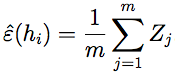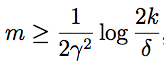

Now, let’s assume that uniform convergence holds, i.e., that |ε(h)−εˆ(h)| ≤ γ for all h ∈ H. What can we prove about the generalization of our learning algorithm that picked hˆ = arg minh∈H εˆ(h)?

现在，我们假设这个联合收敛成立（uniform convergence holds），也就是说，对于所有的 h ∈ H，都有 |ε(h)−εˆ(h)| ≤ γ。我们的学习算法选择了 hˆ = arg minh∈H εˆ(h)，关于这种算法的泛化，我们能给出什么相关的证明呢？

Define h∗ = arg minh∈H ε(h) to be the best possible hypothesis in H. Note that h∗ is the best that we could possibly do given that we are using H, so it makes sense to compare our performance to that of h∗. We have:

将 h∗ = arg minh∈H ε(h) 定义为 H 中最佳可能假设（best possible hypothesis）。这里要注意此处的 h∗ 是我们使用假设集合 H 所能找出的最佳假设，所以很自然地，我们就能理解可以用这个 h∗ 来进行性能对比了。则有：

上面的第一行用到了定理 | ε (hˆ ) − εˆ (hˆ ) | ≤ γ（可以通过上面的联合收敛假设来推出）。第二行用到的定理是 hˆ 是选来用于得到最小 εˆ(h) ，然后因此对于所有的 h 都有 εˆ(hˆ) ≤ εˆ(h)，也就自然能推出 εˆ(hˆ) ≤ εˆ(h∗)。第三行再次用到了上面的联合收敛假设，此假设表明 εˆ(h∗) ≤ ε(h∗) + γ。所以，我们就能得出下面这样的结论：如果联合收敛成立，那么 hˆ 的泛化误差最多也就与 H 中的最佳可能假设相差 2γ。

好了，咱们接下来就把上面这一大堆整理成一条定理（theorem）。设 |H| = k（译者注：即 H 集合中元素个数为 k），然后设 m 和 δ 为任意的固定值。然后概率至少为 1 − δ，则有：

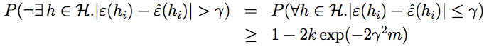

This is proved by letting γ equal the  term，using our previous argument that uniform convergence occurs with probability at least 1 − δ, and then noting that uniform convergence implies ε(h) is at most 2γ higher than ε(h∗) = minh∈H ε(h) (as we showed previously).

上面这个可以通过令 γ 等于平方根的形式，然后利用我们之前得到的概率至少为 1 – δ 的情况下联合收敛成立，接下来利用联合收敛能表明 ε(h) 最多比 ε(h∗) = minh∈H ε(h) 多 2γ（这个前面我们已经证明过了）。

这也对我们之前提到过的在模型选择的过程中在偏差（bias）/方差（variance）之间的权衡给出了定量方式。例如，加入我们有某个假设类 H，然后考虑切换成某个更大规模的假设类 H′ ⊇ H。如果我们切换到了 H′ ，那么第一次的 minh ε(h) 只可能降低（因为我们这次在一个更大规模的函数集合里面来选取最小值了）。因此，使用一个更大规模的假设类来进行学习，我们的学习算法的“偏差（bias）”只会降低。然而，如果 k 值增大了，那么第二项的那个二倍平方根项也会增大。这一项的增大就会导致我们使用一个更大规模的假设的时候，“方差（variance）”就会增大。

By holding γ and δ fixed and solving for m like we did before, we can also obtain the following sample complexity bound

通过保持 γ 和 δ 为固定值，然后像上面一样求解 m，我们还能够得到下面的样本复杂度约束：

Corollary. Let |H| = k, and let any δ,γ be fixed. Then for ε(hˆ) ≤ minh∈H ε(h) + 2γ to hold with probability at least 1 − δ, it suffices that

推论（Corollary）：设 |H| = k ，然后令 δ,γ 为任意的固定值。对于满足概率最少为 1 − δ 的 ε(hˆ) ≤ minh∈H ε(h) + 2γ ，下面等式关系成立：

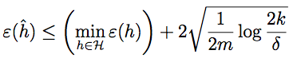

# 4 无限个假设（infinite H）的情况 

We have proved some useful theorems for the case of finite hypothesis classes. But many hypothesis classes, including any parameterized by real numbers (as in linear classification) actually contain an infinite number of functions. Can we prove similar results for this setting?

Let’s start by going through something that is not the “right” argument. Better and more general arguments exist, but this will be useful for honing our intuitions about the domain.

Suppose we have an H that is parameterized by d real numbers. Since we

are using a computer to represent real numbers, and IEEE double-precision

floating point (double’s in C) uses 64 bits to represent a floating point number, this means that our learning algorithm, assuming we’re using double-

precision floating point, is parameterized by 64d bits. Thus, our hypothesis

class really consists of at most k = 264d different hypotheses. From the Corollary at the end of the previous section, we therefore find that, to guarantee

ε(hˆ) ≤ ε(h∗) + 2γ, with to hold with probability at least 1 − δ, it suffices

that m≥O 1 log264d =O d log1 =O (d). (The γ,δ subscripts are γ2 δ γ2 δ γ,δ

to indicate that the last big-O is hiding constants that may depend on γ and δ.) Thus, the number of training examples needed is at most linear in the parameters of the model.

The fact that we relied on 64-bit floating point makes this argument not entirely satisfying, but the conclusion is nonetheless roughly correct: If what we’re going to do is try to minimize training error, then in order to learn

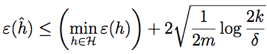    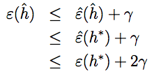   

9

“well” using a hypothesis class that has d parameters, generally we’re going to need on the order of a linear number of training examples in d.

(At this point, it’s worth noting that these results were proved for an algorithm that uses empirical risk minimization. Thus, while the linear dependence of sample complexity on d does generally hold for most discriminative learning algorithms that try to minimize training error or some approximtion to training error, these conclusions do not always apply as readily to discriminative learning algorithms. Giving good theoretical guarantees on many non-ERM learning algorithms is still an area of active research.)

The other part of our previous argument that’s slightly unsatisfying is that it relies on the parameterization of H. Intuitively, this doesn’t seem like it should matter: We had written the class of linear classifiers as hθ(x) = 1{θ0 + θ1x1 + ···θnxn ≥ 0}, with n + 1 parameters θ0,...,θn. But it could also be written hu,v(x) = 1{(u20 − v02) + (u21 − v12)x1 + ···(u2n − vn2)xn ≥ 0} with 2n + 2 parameters ui, vi. Yet, both of these are just defining the same H: The set of linear classifiers in n dimensions.

To derive a more satisfying argument, let’s define a few more things.

Given a set S = {x(i), . . . , x(d)} (no relation to the training set) of points x(i) ∈ X, we say that H shatters S if H can realize any labeling on S. I.e., if for any set of labels {y(1), . . . , y(d)}, there exists some h ∈ H so that h(x(i)) = y(i) for all i = 1,...d.

Given a hypothesis class H, we then define its Vapnik-Chervonenkis dimension, written VC(H), to be the size of the largest set that is shattered by H. (If H can shatter arbitrarily large sets, then VC(H) = ∞.)

For instance, consider the following set of three points:

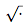

Can the set H of linear classifiers in two dimensions (h(x) = 1{θ0 +θ1x1 + θ2x2 ≥ 0}) can shatter the set above? The answer is yes. Specifically, we see that, for any of the eight possible labelings of these points, we can find a linear classifier that obtains “zero training error” on them:

Moreover, it is possible to show that there is no set of 4 points that this hypothesis class can shatter. Thus, the largest set that H can shatter is of size 3, and hence VC(H) = 3.

Note that the VC dimension of H here is 3 even though there may be sets of size 3 that it cannot shatter. For instance, if we had a set of three points lying in a straight line (left figure), then there is no way to find a linear separator for the labeling of the three points shown below (right figure):

In order words, under the definition of the VC dimension, in order to prove that VC(H) is at least d, we need to show only that there’s at least one set of size d that H can shatter.

The following theorem, due to Vapnik, can then be shown. (This is, many would argue, the most important theorem in all of learning theory.)

11

Theorem. Let H be given, and let d = VC(H). Then with probability at least 1−δ, we have that for all h∈H,

Thus, with probability at least 1 − δ, we also have that:

In other words, if a hypothesis class has finite VC dimension, then uniform convergence occurs as m becomes large. As before, this allows us to give a bound on ε(h) in terms of ε(h∗). We also have the following corollary:

Corollary. For |ε(h) − εˆ(h)| ≤ γ to hold for all h ∈ H (and hence ε(hˆ) ≤ ε(h∗) + 2γ) with probability at least 1 − δ, it suffices that m = Oγ,δ(d).

In other words, the number of training examples needed to learn “well” using H is linear in the VC dimension of H. It turns out that, for “most” hypothesis classes, the VC dimension (assuming a “reasonable” parameterization) is also roughly linear in the number of parameters. Putting these together, we conclude that (for an algorithm that tries to minimize training error) the number of training examples needed is usually roughly linear in the number of parameters of H.
